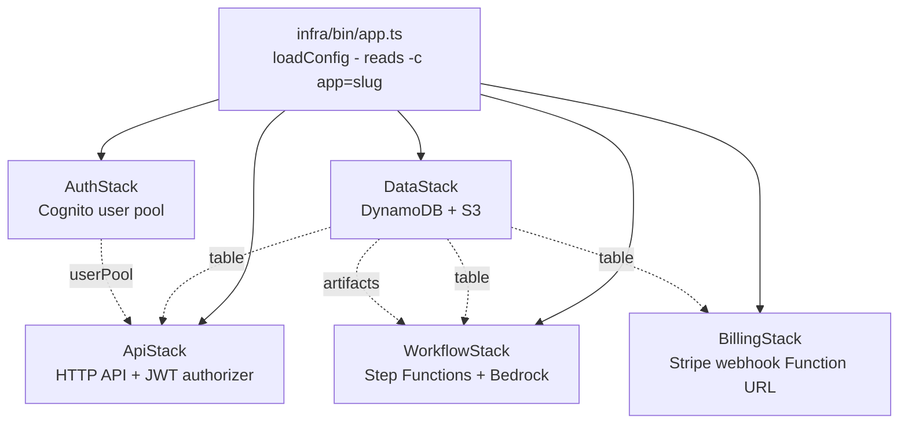

# ai-saas-blueprint

> One `cdk deploy` mints a paywalled, multi-tenant AI workflow SaaS on AWS.

[](LICENSE)
[](https://docs.aws.amazon.com/cdk/v2/guide/home.html)
[](https://nodejs.org)
[](docs/phase-0-tasks.md)

A reusable AWS CDK app for stamping out independent AI-workflow products. Each invocation with `-c app=<slug>` deploys a fully isolated product: Cognito user pool, single-table DynamoDB, HTTP API behind a JWT authorizer, a Step Functions workflow that calls Bedrock, and a Stripe Checkout paywall.

**Same code. N independent deployments. Adding a workflow is a folder. Adding a product is one command.**

---

## What `cdk deploy` mints

A single deploy creates five stacks, all prefixed by your product slug:

| Stack | Resources |
|---|---|
| **Data** | One DynamoDB table (single-table design, on-demand) + S3 artifacts bucket. Both `RETAIN` on delete. |
| **Auth** | Cognito user pool with a `custom:tenant_id` claim + app client. |
| **Api** | HTTP API Gateway + JWT authorizer + handler Lambda. |
| **Workflow** | Step Functions Standard state machine + Bedrock IAM + runner Lambda. |
| **Billing** | Stripe webhook Lambda on a Function URL + Secrets Manager secret for the signing key. |

Status: **the skeleton synths clean**. Handler bodies are intentional placeholders, tracked in [`docs/phase-0-tasks.md`](docs/phase-0-tasks.md).

## Architecture at a glance



`Data` and `Auth` have no dependencies; everything else consumes them by reference. Full diagrams (signup, paywall upgrade, workflow execution) live in [`docs/architecture.md`](docs/architecture.md).

## Quickstart

### Prerequisites

- Node 20+
- AWS credentials with permission to bootstrap and deploy CDK (uses default profile — no `--profile` flag)
- `npx cdk bootstrap` run once per account/region

### Deploy

```bash
npm install
cp .env.example .env   # fill in Stripe test keys when you reach Phase 0 task 6

cd infra
npx cdk deploy --all -c app=demo-a            # Product A
npx cdk deploy --all -c app=demo-b            # Product B, fully independent
```

Slugs must be lowercase, hyphen-separated, 3–32 chars, start with a letter. Full runbook: [`docs/deploy.md`](docs/deploy.md).

## Hard rules (security model)

These are non-negotiable. Code review rejects violations. Full text in [`CLAUDE.md §4`](CLAUDE.md).

1. **Tenant identity flows from the JWT**, never from the request body.
2. **Every DynamoDB key starts with `TENANT#<tenantId>`**, enforced by IAM `dynamodb:LeadingKeys`.
3. **Tenant context never flows through the LLM** — it rides in IAM/session tags, not prompts.
4. **The Stripe webhook verifies signatures before reading the body.**
5. **Entitlement checks fail closed.** A malformed plan record denies the run.
6. **No mock data, no fallback values for user data.** Missing data is a real condition, not a default.
7. **Public APIs change via ADR.** JWT shape, DDB keys, `EntitlementProvider`, webhook contract, HTTP surface.
8. **`RemovalPolicy.RETAIN` is the default** for tables and buckets. Losing tenant data to a typo is not recoverable.

## v1 stack at a glance

| Layer | Choice | Why |
|---|---|---|
| Identity | Cognito pooled, `custom:tenant_id` claim | Operationally simplest; siloed pools deferred until a customer pays for data residency |
| Data | DynamoDB single table, on-demand | One table per product; tenant prefix on every key; IAM `LeadingKeys` enforces isolation |
| Paywall | Stripe Checkout + 1 webhook on a Function URL | Smallest thing that charges money; Meters and Marketplace deferred behind the `EntitlementProvider` interface |
| Workflows | Step Functions Standard + Bedrock direct | Native, visual, deterministic pricing; LangGraph on ECS deferred |
| LLM | Amazon Bedrock (Claude 3.5 Sonnet default) | No data egress, no training on customer data, IAM-native |
| Repo | npm workspaces, no Turborepo | Fewer moving parts; add bundlers when build time justifies |

Full rationale: [`docs/adr/0001-v1-locked-decisions.md`](docs/adr/0001-v1-locked-decisions.md).

## Project layout

```
ai-saas-blueprint/
  CLAUDE.md           agent/human onboarding (read first)
  README.md           you are here
  research.txt        original product spec
  ai-saas-workflow-blueprint-architecture.md   background research
  docs/               ADRs, architecture, extension recipes
  infra/              CDK app (5 stacks per deploy)
  packages/           workspace libraries
    shared/             types, plan constants, DDB key helpers
    entitlement/        EntitlementProvider interface + Stripe impl
    workflow-engine/    WorkflowRunner shell
  lambdas/            handler sources (bundled by NodejsFunction)
    api/                Cognito-authenticated HTTP API
    stripe-webhook/     Stripe Function URL endpoint
    workflow-runner/    Step Functions task Lambda
  workflows/          one folder per product workflow
    example-chatbot/
```

## Documentation map

Picking this up cold? Read in this order:

1. [`CLAUDE.md`](CLAUDE.md) — mission, hard rules, conventions.
2. [`docs/adr/0001-v1-locked-decisions.md`](docs/adr/0001-v1-locked-decisions.md) — what was decided and why.
3. [`docs/architecture.md`](docs/architecture.md) — system overview with diagrams.
4. [`docs/phase-0-tasks.md`](docs/phase-0-tasks.md) — ordered build list to first paying customer.

Reference:

- [`docs/adr/0002-entitlement-interface.md`](docs/adr/0002-entitlement-interface.md) — abstraction that lets new billing channels land without touching the workflow engine; defines the atomic `reserveRun` gate
- [`docs/adr/0003-minimalist-paywall.md`](docs/adr/0003-minimalist-paywall.md) — exactly what v1 charges and how
- [`docs/adr/0004-stripe-webhook-hardening.md`](docs/adr/0004-stripe-webhook-hardening.md) — reserved concurrency + DLQ
- [`docs/adr/0005-pricing-needs-validation.md`](docs/adr/0005-pricing-needs-validation.md) — unit economics open question
- [`docs/adr/0006-streaming-deferred.md`](docs/adr/0006-streaming-deferred.md) — why workflow output is batch-only in v1
- [`docs/adr/0007-bedrock-guardrails-stub.md`](docs/adr/0007-bedrock-guardrails-stub.md) — wired but optional
- [`docs/adr/0008-typed-api-clients.md`](docs/adr/0008-typed-api-clients.md) — zod schemas → OpenAPI (proposed)
- [`docs/data-model.md`](docs/data-model.md) — DynamoDB schema and access patterns
- [`docs/security.md`](docs/security.md) — defense-in-depth layers and threat model
- [`docs/extending.md`](docs/extending.md) — recipes for adding workflows, billing channels, stacks
- [`docs/deploy.md`](docs/deploy.md) — operational runbook
- [`docs/runbooks/tenant-deletion.md`](docs/runbooks/tenant-deletion.md) — GDPR/CCPA tenant delete
- [`research.txt`](research.txt) — original product spec
- [`ai-saas-workflow-blueprint-architecture.md`](ai-saas-workflow-blueprint-architecture.md) — background research

## Verifying a fresh checkout

```bash
npm install
npm run verify   # runs vitest + synths two distinct slugs
```

`npm run verify` runs the unit suite and then synthesizes against two distinct slugs (`verify-a`, `verify-b`) to confirm the stack sets are disjoint. The same command runs in CI on every PR (`.github/workflows/ci.yml`).

## License

[Apache 2.0](LICENSE).
