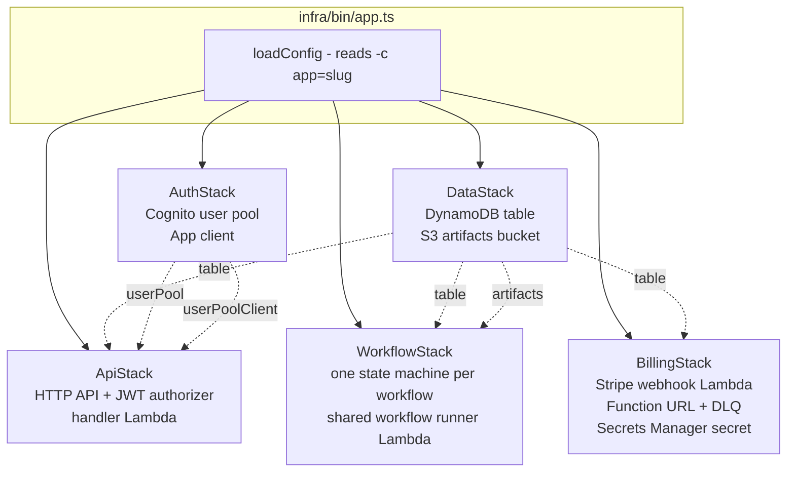
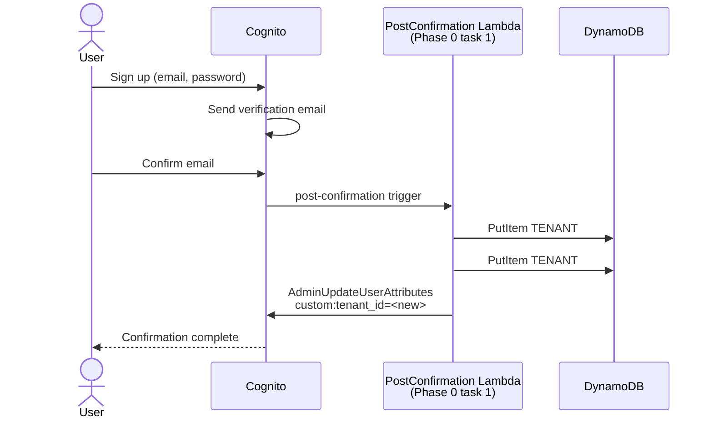
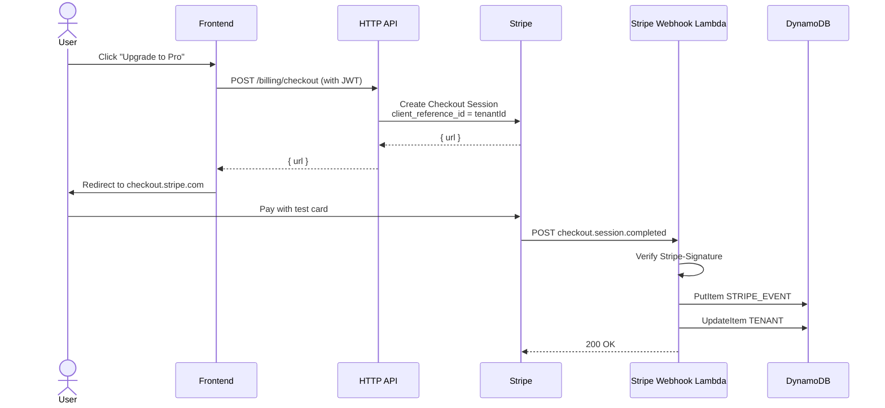
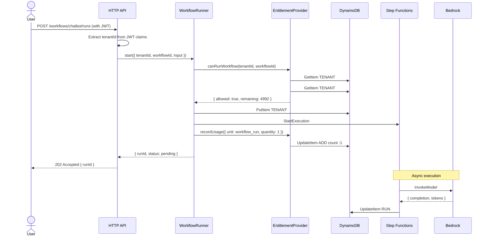
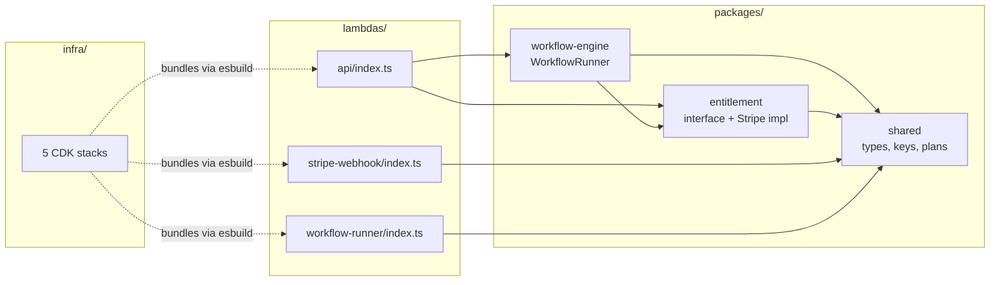
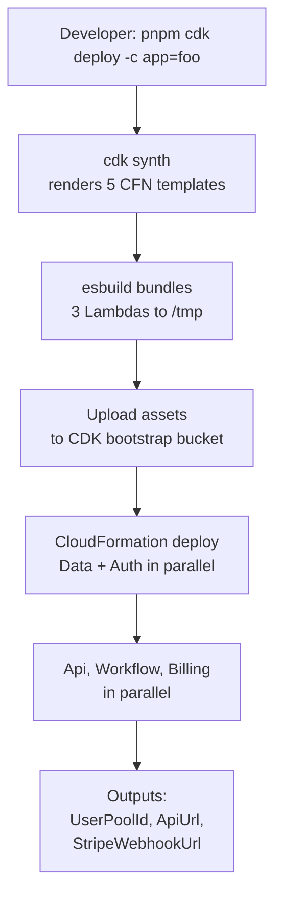

# Architecture

System overview for the v1 blueprint. For decision rationale see the ADRs. For data shape see `data-model.md`. For threat model see `security.md`.

## 1. Mental model

One `cdk deploy -c app=<slug>` produces one **product**. A product is five CloudFormation stacks deployed into one AWS account/region, all sharing a single Cognito user pool, a single DynamoDB table, and a single Step Functions state machine. The product hosts many **tenants** (paying customers). Each tenant runs many **workflows**.

```
AWS Account
└── Product: support-bot (one cdk deploy)
    ├── Tenant: acme-corp        ──┐
    ├── Tenant: globex-inc         │  All tenants share infra,
    ├── Tenant: initech            ├─ isolated by partition key
    └── ...                       ──┘   + IAM session tags
        Each tenant runs:
        ├── workflow: chatbot
        ├── workflow: document-review
        └── ...
```

You can deploy many products into the same AWS account. Resource names are prefixed by product slug; nothing collides.

## 2. Stack topology



DataStack and AuthStack have no dependencies; everything else consumes them by reference. Deploys are ordered by CDK automatically based on these references.

## 3. Request flows

### 3.1 New tenant signup (v1: single-user-tenant)



The post-confirmation Lambda is the only writer of `custom:tenant_id`. Once set, every subsequent JWT carries it.

### 3.2 Tenant upgrades to a paid plan



Two important details:

- The `client_reference_id` in the Checkout Session is the tenantId. That's how the webhook knows whose plan to update.
- Idempotency: Stripe retries failed deliveries for 3 days. The `STRIPE_EVENT#<id>` row with `attribute_not_exists` makes retries safe.

### 3.3 Tenant runs a workflow



The synchronous path returns in <200ms. Workflow execution is async; clients poll `GET /workflows/<id>/runs/<runId>` or subscribe via WebSocket (Phase 1).

## 4. Code topology



Lambdas import workspace packages by name (`@ai-saas-blueprint/shared`). NodejsFunction's esbuild bundling resolves them through npm workspace symlinks and tree-shakes unused exports. No build step needed before `cdk synth`.

## 5. Deploy flow



A fresh full deploy takes ~3-5 minutes. Incremental deploys (one stack changed) take ~30-90 seconds. The Stripe webhook URL must be registered in the Stripe Dashboard after first deploy; see `deploy.md §2`.

## 6. Per-product blast radius

What is shared across products in the same AWS account vs. isolated:

| Resource | Shared between products? |
|----------|--------------------------|
| AWS account | yes (intentionally; reduces ops cost at small scale) |
| IAM roles | no — each Lambda has its own role |
| CloudWatch logs | no — log groups are `/<app>/<env>/...` |
| DynamoDB table | no — one per product |
| S3 artifact bucket | no — one per product |
| Cognito user pool | no — one per product (a tenant of product A cannot log into product B) |
| Step Functions state machine | no — one per product |
| Stripe webhook endpoint | no — one Function URL per product |
| Secrets Manager secret | no — one per product per env |
| Bedrock model access | yes (IAM scopes to model ARN, which is account-wide) |

The shared items are bound by IAM and resource naming, not by namespace. Two products can be torn down independently with zero risk to each other's data.

## 7. Cost model at a glance

For per-run economics see `ai-saas-workflow-blueprint-architecture.md` §"AWS Cost Model." Calibrating expectations:

| Bucket | Order of magnitude |
|--------|---------------------|
| Per workflow run | ~$0.01 (Sonnet 4, 1K in / 500 out tokens) |
| Idle product (no traffic) | <$5/month (Cognito MAU free tier covers most cases) |
| 1,000 runs/day at Sonnet 4 | ~$10/day in Bedrock tokens, +~$1/day infra |
| Bedrock as % of run cost | ~95% |

The highest-leverage cost lever is model choice. The next is prompt length. Infrastructure costs are negligible until you have thousands of tenants.

## 8. Observability surfaces

Currently:

- CloudWatch Logs: `/aws/lambda/<app>-<env>-<role>`
- CloudWatch Logs: `/aws/vendedlogs/states/<app>-<env>-workflow`
- X-Ray tracing enabled on Lambdas and Step Functions

Phase 0 task 7 adds:

- Embedded Metric Format (EMF) for tenant-dimensioned metrics
- CloudWatch dashboards per product (workflow runs/min, errors, p95 latency, Bedrock token volume)
- Anomaly-detection alarm on monthly spend

The deeper pipeline (EMF → Firehose → S3 → Athena → QuickSight) from `ai-saas-workflow-blueprint-architecture.md` §"Observability" is deferred until tenant count justifies the build cost.

## 9. What's not yet wired

The skeleton synths and deploys, but the handlers are placeholders. Phase 0 task list (`docs/phase-0-tasks.md`) is the canonical TODO. Highest-leverage items first:

1. Cognito post-confirmation Lambda (creates tenant + user rows)
2. Pre-token-generation Lambda (injects `custom:tenant_id`)
3. Stripe webhook real implementation (signature check, idempotency, plan writes)
4. API handlers (`POST /workflows/{id}/runs`, etc.)
5. Workflow runner Bedrock invocation
6. Per-tenant isolation tests
